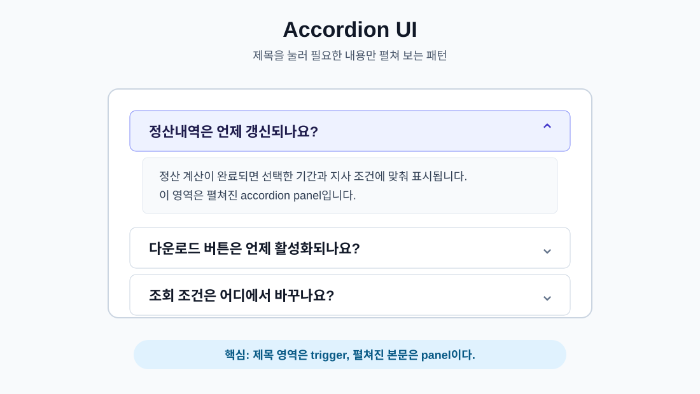
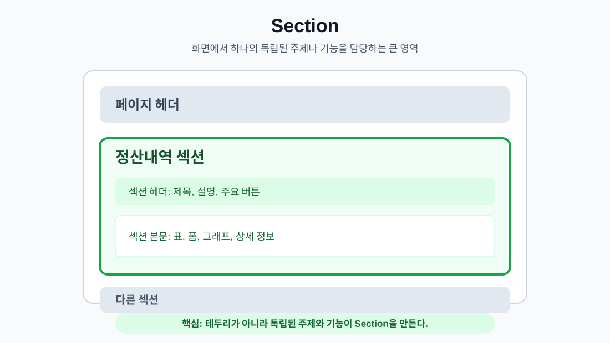
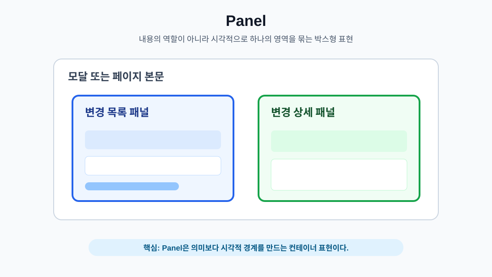
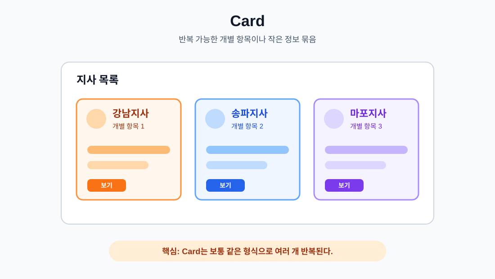
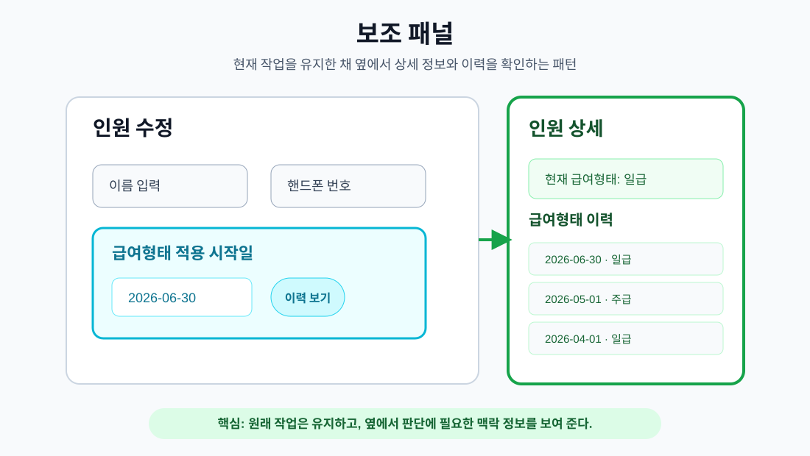
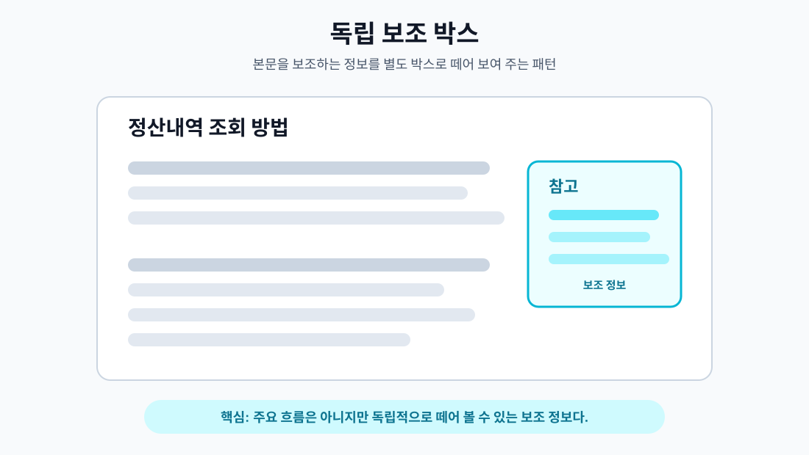

# UI 구성 요소와 화면 패턴 도감

## 한 줄 요약

이 문서는 UI 작업 중 자주 나오는 구성 요소와 화면 패턴을 그림으로 구분하기 위한 도감이다. `accordion`, `section`, `card`, `보조 패널`, `독립 보조 박스`처럼 이름만으로 헷갈리기 쉬운 개념을 실제 모양, 쓰임, 구분 기준 중심으로 정리한다.

## 이 문서의 사용 방식

새로운 UI 용어가 헷갈릴 때는 이 문서에 항목을 추가한다. 각 항목은 다음 형식을 따른다.

- 이름
- 한 줄 정의
- 그림
- 언제 쓰는지
- 다른 패턴과 구분하는 기준

이 문서의 목적은 HTML 표준 전체를 설명하는 것이 아니다. UI를 만들거나 수정할 때 "이건 카드인가, 섹션인가, 접히는 영역인가, 보조 박스인가"를 빠르게 판단하게 만드는 것이다.

## 빠른 구분표

| 이름 | 핵심 질문 | 대표 모습 |
| --- | --- | --- |
| Accordion UI | 제목을 눌러 내용을 펼치고 접는가? | 여러 개의 접히는 항목 |
| Section | 하나의 독립된 주제나 기능 영역인가? | 화면이나 모달 안의 제목과 본문을 가진 구역 |
| Panel | 테두리, 배경, padding으로 하나의 영역을 시각적으로 묶는가? | 기능 영역이나 상세 영역을 감싸는 박스형 컨테이너 |
| Card | 반복 가능한 개별 항목인가? | 목록이나 그리드 안의 작은 정보 단위 |
| 보조 패널 | 현재 작업을 돕는 상세 정보나 이력을 옆에 붙여 보여 주는가? | 본문이나 모달 옆의 별도 패널 |
| 독립 보조 박스 | 본문을 보조하지만 별도 영역으로 떼어져 있는가? | 참고, 주의, 팁, 요약 박스 |

## Accordion UI

Accordion UI는 여러 항목의 제목을 보여 주고, 사용자가 제목을 누르면 해당 항목의 본문을 펼치거나 접는 UI 패턴이다.



### 언제 쓰는가

- FAQ처럼 질문과 답변이 여러 개 있을 때
- 설정, 도움말, 상세 조건처럼 사용자가 필요한 항목만 열어 보면 되는 경우
- 모바일 화면에서 긴 내용을 한 번에 모두 펼치면 탐색이 어려운 경우
- 같은 형식의 설명 묶음이 반복되고, 각 묶음의 본문이 길 수 있는 경우

### 구분 기준

Accordion의 핵심은 접힘과 펼침이다. 단순히 제목 아래에 내용이 있는 영역은 Accordion이 아니다. 사용자가 항목을 열고 닫을 수 있어야 Accordion이다.

Accordion은 Section과 다르다. Section은 독립된 주제 영역이고, Accordion은 내용을 접고 펼치는 상호작용 패턴이다. 하나의 Section 안에 Accordion이 들어갈 수 있다.

## Section

Section은 화면에서 하나의 독립된 주제나 기능을 담당하는 영역이다. 보통 제목, 설명, 조작부, 본문을 함께 가질 수 있다.

Section은 페이지 전체를 나누는 큰 구역에만 쓰는 말이 아니다. 모달 안에서도 `기본 정보`, `등록 정보`, `소속 벤더 1`처럼 제목 아래에 관련 입력이나 내용을 묶은 한 영역은 Section이라고 부를 수 있다.



### 언제 쓰는가

- 화면 안에서 주제가 분명히 나뉘는 경우
- 한 영역의 제목을 붙일 수 있는 경우
- 필터, 요약, 표, 상세 정보처럼 기능 단위가 분리되는 경우
- 접근성 관점에서 별도의 영역으로 이해되는 것이 자연스러운 경우
- 모달 내부에서 관련 입력이나 정보를 제목 아래에 묶어 구분해야 하는 경우

### 구분 기준

Section의 핵심은 독립된 주제나 기능이다. 테두리나 배경이 있어야 Section이 되는 것은 아니다. 시각적으로 아무 테두리가 없어도 독립된 주제 영역이면 Section이다.

Section은 Card와 다르다. Section은 화면을 나누는 큰 구역이고, Card는 목록이나 그리드에서 반복 가능한 개별 항목이다.

Section은 Panel과도 다르다. Section은 영역의 의미이고, Panel은 테두리, 배경, padding으로 묶은 시각 표현이다. 그래서 하나의 요소가 `section`이면서 동시에 `section-panel`처럼 보일 수 있다.

## Panel

Panel은 관련된 내용을 테두리, 배경, padding으로 감싸 시각적으로 하나의 덩어리처럼 보이게 하는 컨테이너 표현이다.

Panel은 의미 단위라기보다 시각적 표현에 가깝다. 같은 영역도 문서 구조상으로는 Section일 수 있고, 화면 표현상으로는 Panel처럼 보일 수 있다.



### 언제 쓰는가

- 모달이나 페이지 안에서 서로 다른 정보 영역을 시각적으로 분리해야 하는 경우
- 목록과 상세, 필터와 결과, 요약과 본문처럼 나란히 놓인 영역의 경계를 분명히 해야 하는 경우
- 배경, 테두리, padding이 있어야 사용자가 하나의 조작 또는 확인 단위로 인식하기 쉬운 경우
- 독립된 화면 섹션 전체보다는 작지만, 단순 텍스트 묶음보다는 강한 시각적 구분이 필요한 경우

### 구분 기준

Panel의 핵심은 시각적 묶음이다. Panel이라고 부를 때는 내용의 역할까지 함께 붙여 부르는 것이 좋다. 예를 들어 `변경 목록 패널`, `변경 상세 패널`, `필터 패널`, `미리보기 패널`처럼 이름을 붙이면 이 영역이 무엇을 담는지 명확해진다.

Panel은 Section과 다르다. Section은 독립된 주제나 기능이라는 의미 단위이고, Panel은 그 의미 단위를 눈에 보이는 박스로 감싸는 표현이다. 하나의 Section이 Panel처럼 스타일링될 수 있다.

Panel은 Card와도 다르다. Card는 반복 가능한 개별 항목이고, Panel은 보통 여러 항목을 담거나 특정 작업 영역 전체를 감싸는 컨테이너다. 테두리가 있다고 해서 모두 Card가 되는 것은 아니다.

Panel은 보조 패널과도 다르다. 보조 패널은 현재 작업 옆에서 이력, 상세, 미리보기처럼 보조 정보를 제공하는 역할을 가진다. Panel은 그런 역할까지 포함하지 않고, 단지 박스형 컨테이너 표현을 가리킨다.

## Card

Card는 하나의 개별 항목이나 작은 정보 묶음을 담는 UI 패턴이다. 여러 개가 반복되어 목록이나 그리드를 구성하는 경우가 많다.



### 언제 쓰는가

- 같은 형식의 항목이 여러 개 반복되는 경우
- 각 항목이 제목, 상태, 요약, 버튼을 함께 가지는 경우
- 목록보다 시각적으로 더 풍부한 항목 단위가 필요한 경우
- 상품, 사람, 알림, 프로젝트, 지표 요약처럼 하나의 대상을 카드 하나로 표현할 수 있는 경우

### 구분 기준

Card의 핵심은 반복 가능한 개별 항목이다. 화면에서 테두리가 있는 큰 박스라고 해서 모두 Card는 아니다. 페이지의 큰 기능 영역이면 Section이나 Panel에 가깝고, 목록 속 개별 항목이면 Card에 가깝다.

Card는 독립 보조 박스와도 다르다. Card는 보통 여러 개가 같은 형식으로 반복된다. 독립 보조 박스는 본문을 보조하기 위해 단독으로 놓이는 경우가 많다.

## 보조 패널

보조 패널은 사용자가 현재 작업을 계속하면서 판단에 필요한 상세 정보, 이력, 미리보기, 보조 설정을 옆에서 확인할 수 있게 붙여 두는 UI 패턴이다.



### 언제 쓰는가

- 입력값을 결정할 때 과거 이력이나 상세 정보를 함께 봐야 하는 경우
- 모달이나 본문 작업 흐름을 끊지 않고 참고 정보를 확인해야 하는 경우
- 사용자가 한쪽에서는 수정하고, 다른 한쪽에서는 읽기 전용 정보를 비교해야 하는 경우
- 작은 팝오버로는 정보량이 부족하고, 별도 전체 화면으로 보내면 작업 맥락이 끊기는 경우

### 구분 기준

보조 패널의 핵심은 현재 작업 옆에서 맥락 정보를 제공한다는 점이다. 사용자는 원래 작업을 유지한 채 패널을 열고 닫을 수 있다.

보조 패널은 독립 보조 박스와 다르다. 독립 보조 박스는 본문 안의 참고, 주의, 팁처럼 비교적 정적인 보조 정보에 가깝다. 보조 패널은 상세 정보, 이력, 미리보기처럼 현재 작업 판단에 필요한 별도 영역이며, 모달이나 화면 옆에 붙는 경우가 많다.

보조 패널은 Drawer와도 다르다. Drawer는 보통 화면 가장자리에서 슬라이드되어 나오고, 열리는 동작 자체가 패턴의 중요한 특징이다. 보조 패널은 슬라이드 여부보다 현재 작업 영역 옆에서 보조 정보를 지속적으로 보여 주는 역할이 핵심이다.

## 독립 보조 박스

독립 보조 박스는 본문 흐름을 보조하는 정보를 별도 박스로 떼어 보여 주는 UI 패턴이다. 이 문서에서는 참고, 주의, 팁, 요약, 보조 설명처럼 본문보다 한 단계 보조적인 정보를 담는 독립 영역을 이렇게 부른다.



### 언제 쓰는가

- 본문 이해를 돕는 참고 정보를 분리해서 보여 주고 싶을 때
- 중요한 주의사항을 본문 중간에서 눈에 띄게 보여 줘야 할 때
- 핵심 흐름을 방해하지 않으면서 보조 설명을 제공해야 할 때
- 한 페이지 안에서 작은 요약, 팁, 제한 조건을 따로 강조해야 할 때

### 구분 기준

독립 보조 박스의 핵심은 보조 정보다. 화면의 주요 기능 단위가 아니므로 Section보다 작고, 반복 항목이 아니므로 Card와도 다르다.

보조 박스가 문서 본문 옆에 놓이면 HTML에서는 `aside`가 어울릴 수 있다. 본문 안에서 참고나 주의 문구로 들어가면 `div`에 `callout`, `notice`, `tip-box` 같은 class를 붙일 수 있다.

## 앞으로 항목을 추가하는 방식

새로운 UI 개념을 추가할 때는 다음 템플릿을 사용한다.

````md
## 이름

한 줄 정의를 쓴다.

이미지 경로: ./assets/UIPatternCatalog/file-name.svg

### 언제 쓰는가

- 사용하는 상황을 적는다.

### 구분 기준

비슷한 UI와 무엇이 다른지 적는다.

````

## 관련 문서

- [ReactFrontend.md](./ReactFrontend.md): React에서 화면을 컴포넌트로 구성하는 기본 배경을 설명한다.
- [HTTPAndBrowser.md](./HTTPAndBrowser.md): 브라우저가 HTML, CSS, JavaScript를 받아 화면을 만드는 배경을 설명한다.


